<!-- Please do not change this logo with link -->

[](https://www.microchip.com)

# pic18f16q41 Analog-Serial-Read and LED Toggle

In this example, we will show how to toggle a LED on and off for 500 milliseconds as well as showing how to create an analog-serial-read using a terminal emulator and potentiometer. Both demos were featured in the Future Electronics webinar titled “Reduce Your Time to Market with the MPLAB® Ecosystem of Software and Hardware Tools” from November 3rd, 2021 which can be found [here](https://www.futureelectronics.com/resources/events/microchip-8-bit-technology-webinar-series).

## Related Documentation

https://www.microchip.com/en-us/product/PIC18F16Q41

https://ww1.microchip.com/downloads/en/DeviceDoc/PIC18F06-16Q41-DataSheet-40002214C.pdf

https://ww1.microchip.com/downloads/en/DeviceDoc/PIC18F16Q41-Curiosity-Nano-Hardware-User-Guide-DS50003048A.pdf

https://www.futureelectronics.com/resources/events/microchip-8-bit-technology-webinar-series


## Software Used

<!-- All software used in this example must be listed here. Use unbreakable links!
     - MPLAB® X IDE 5.30 or newer [(microchip.com/mplab/mplab-x-ide)](http://www.microchip.com/mplab/mplab-x-ide)
     - MPLAB® XC8 2.10 or a newer compiler [(microchip.com/mplab/compilers)](http://www.microchip.com/mplab/compilers)
     - MPLAB® Code Configurator (MCC) 3.95.0 or newer [(microchip.com/mplab/mplab-code-configurator)](https://www.microchip.com/mplab/mplab-code-configurator)
     - MPLAB® Code Configurator (MCC) Device Libraries PIC10 / PIC12 / PIC16 / PIC18 MCUs [(microchip.com/mplab/mplab-code-configurator)](https://www.microchip.com/mplab/mplab-code-configurator)
     - Microchip PIC18F-Q Series Device Support (1.4.109) or newer [(packs.download.microchip.com/)](https://packs.download.microchip.com/) -->

- MPLAB® X IDE 5.50.0 or newer [(MPLAB® X IDE 5.50)](https://www.microchip.com/en-us/development-tools-tools-and-software/mplab-x-ide?utm_source=GitHub&utm_medium=TextLink&utm_campaign=MCU8_MMTCha_MPAE_Examples&utm_content=pic18f16q41-analog-serial-read-mplab-mcc-github)
- MPLAB® XC8 2.32.0 or newer compiler [(MPLAB® XC8 2.32)](https://www.microchip.com/en-us/development-tools-tools-and-software/mplab-xc-compilers?utm_source=GitHub&utm_medium=TextLink&utm_campaign=MCU8_MMTCha_MPAE_Examples&utm_content=pic18f16q41-analog-serial-read-mplab-mcc-github)
- MPLAB® Code Configurator 5.0.3 or newer [(MPLAB® MCC 5.0.3)](https://www.microchip.com/en-us/development-tools-tools-and-software/embedded-software-center/mplab-code-configurator?utm_source=GitHub&utm_medium=TextLink&utm_campaign=MCU8_MMTCha_pic18q41&utm_content=pic18f16q41-analog-serial-read-mplab-mcc-github)
- MPLAB® Data Visualizer 1.3.1113 or newer [(MPLAB® Data Visualizer 1.3.1113)](https://www.microchip.com/en-us/development-tools-tools-and-software/embedded-software-center/mplab-data-visualizer?utm_source=GitHub&utm_medium=TextLink&utm_campaign=MCU8_MMTCha_pic18q41&utm_content=pic18f16q41-analog-serial-read-mplab-mcc-github)

## Hardware Used

- pic18f16q41 Curiosity Nano development board
- Breadboard
- 5x, jumper wires
- 1x, 10k Ohm potentiometer

## Setup #1: LED Toggle
#### Step #1: Creating the Project
- On the tool bar, click on New Project
- Microchip Embedded; Standalone Project
- Enter the Device
 - For this Project: PIC18F16Q41
- Enter a name for this project, such as “LED_Toggle”
 - Name: “LED_Toggle”
   - Note: The project name cannot have any empty spaces

#### Step #2: MPLAB Code Configurator (MCC)
- Open MPLAB Code Configurator by clicking the blue “MCC” shield in the top toolbar

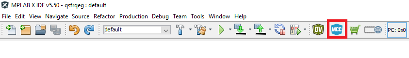

- When MCC opens, select “MCC Melody” and click “Finish” on the next page

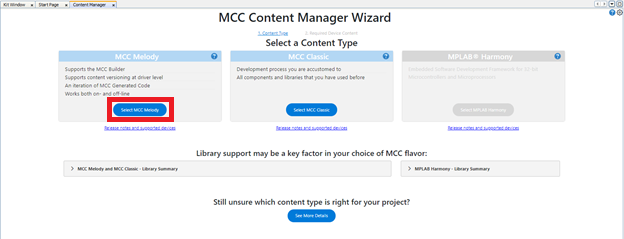

- Modify the Clock Control under “Project Resources” in the top left panel
 - Set “Clock Source” to High Frequency Internal Oscillator (HFINTOSC)
 - Set “HF Internal Clock” to 4_MHz
 - Set “Clock Divider” to 4


- Set Configuration Bits under “Project Resources” in the top left panel
 - Set “External Oscillator Mode Selection” to “Oscillator not enabled”

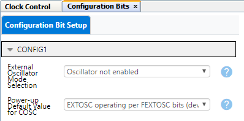

#### Step #3: Configure the Pins

- LED0 is connected to pin RC1
 - Acquire this pin for GPIO output

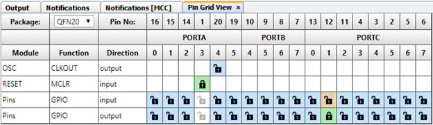

- Assign pin RC1 a custom name of “LED” and ensure all other configurations are as seen below

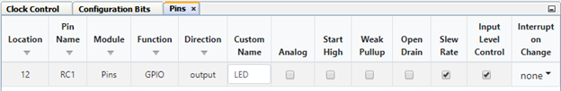

#### Step #4: Generate the project
- Click the generate button in MCC to create the appropriate header and source files for this configuration
- Close MCC by clicking the blue “MCC” shield again

#### Step #6: Modifying main.c
- Upon the generation being completed, the new MCC generated header and source files will be in the project window. Select the main.c file and you will see an empty while(1) loop where you can add your application code.
- Follow this path under “Projects”
 - LED_Toggle -> Header Files -> MCC Generated Files -> System -> pins.h
- Open “pins.h” and scroll down to find the defined function “LED_Toggle()”
 - Copy and paste this function into your main.c, while loop.
 - Below this function, add a delay of 500 milliseconds using “__delay_ms(500);”

```
int main(void)
{
    SYSTEM_Initialize();

    while(1)
    {
        LED_Toggle();
        __delay_ms(500);
    }    
}
```

- Make and program the device and observe the toggling LED

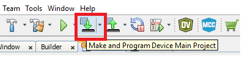

- Result:


## Setup #2: Analog-Serial-Read
#### Step #1: Setting Up the Breadboard
- Follow the image below to set up your bread Breadboard
 - VTG from Curiosity Nano to positive rail
 - GND from Curiosity Nano to negative rail
 - Jumper wire from positive rail to Vcc pin on potentiometer
 - Jumper wire from negative rail to GND pin on potentiometer
 - Jumper wire from pin RA5 on Curiosity Nano to Output pin on potentiometer

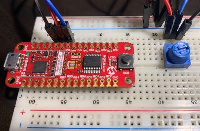

#### Step #2: Creating the Project

- On the tool bar, click on New Project
- Microchip Embedded; Standalone Project
- Enter the Device
 - For this Project: PIC18F16Q41
- Enter a name for this project, such as “Analog_Serial_Read”
 - Name: “Analog_Serial_Read”
   - Note: The project name cannot have any empty spaces

#### Step #3: MPLAB Code Configurator (MCC)
- Open MPLAB Code Configurator by clicking the blue “MCC” shield in the top toolbar


- When MCC opens, select “MCC Melody” and click “Finish” on the next page


- Modify the Clock Control under “Project Resources” in the top left panel
 - Set “Clock Source” to High Frequency Internal Oscillator (HFINTOSC)
 - Set “HF Internal Clock” to 4_MHz
 - Set “Clock Divider” to 1

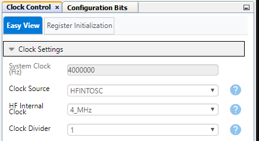

- Set Configuration Bits under “Project Resources” in the top left panel
 - Set “External Oscillator Mode Selection” to “Oscillator not enabled”


#### Step #4: Add ADCC and UART Peripherals
- In Device Resources:
 - Drivers → ADCC → ADCC
 - Drivers → UART → UART1

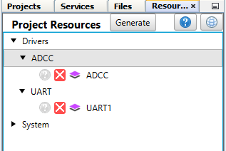

###### Once the peripherals are added, modify the peripherals:
- ADCC
 - Hardware Settings to change while the rest can be left as default
   - Operating Mode = Basic Mode
   - Result Alignment = right
   - Positive Reference = VDD
   - Negative Reference = VSS
   - Acquisition Count = 2

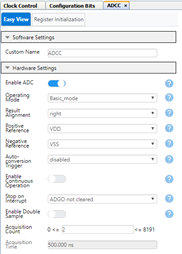

- UART1
  - Software Settings:
   - Enable "Redirect STDIO to UART"
  - Hardware Settings:
   - Enable UART box should be checked
   - Set the Baud Rate to 19200
   - Enable Transmit and Receive should be checked
   - Everything else can be left as default settings

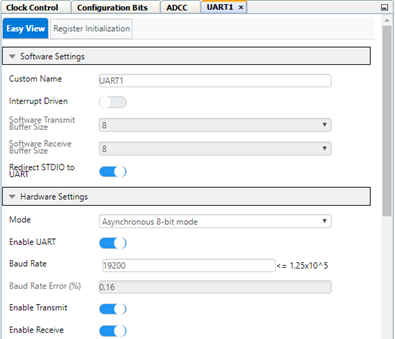

#### Step #5: Configure the Pins
- TX1 is connected to pin RB7
- RX1 is connected to pin RB5
- Connect ADCC “ANx” to pin RA5
  - This is the pin on the Curiosity Nano that our potentiometer is connected to

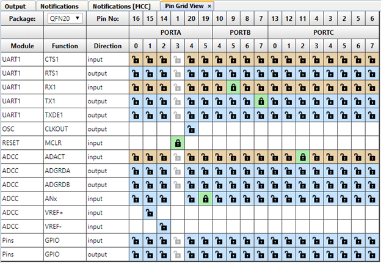

- Assign pin RA5 a custom name of “POT” and ensure all other configurations are as seen below

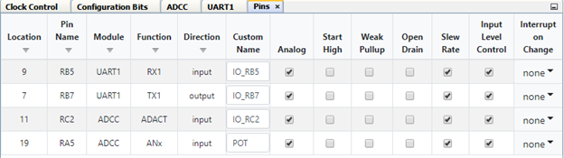

#### Step #6: Generate the Project
- Click the generate button in MCC to create the appropriate header and source files for this configuration

#### Step #7: Modifying main.c
- Upon the generation being completed, the new MCC generated header and source files will be in the project window. Select the main.c file under source files and you will see an empty while(1) loop where you can add your application code.
- Follow this path under “Projects”
  - Analog_Serial_Read -> Header Files -> MCC Generated Files -> ADC -> adcc.h
- Open “adcc.h” and scroll down to find the defined function “adc_result_t ADCC_GetSingleConversion(adcc_channel_t channel);”
  - Copy and paste this function into your main.c, while (1) loop.
- Pass your custom pin name through the function within a “printf()” statement to read the current value from the potentiometer

  ```
  int main(void)
  {
      SYSTEM_Initialize();

      while(1)
      {
          printf("%d\r\n",ADCC_GetSingleConversion(POT));
      }    
  }
  ```

- Make and program the device


#### Step #8: Terminal Emulator
- For this project, the terminal program that is being used is MPLAB Data Visualizer
  - Open Data Visualizer by clicking the green “DV” shield in the top toolbar

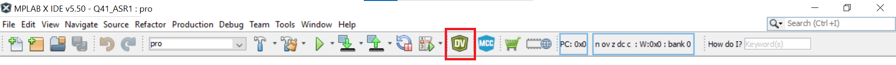

- Click on your Curiosity Nano COM port and set:
  - Baud Rate to: 19200
  - Char Length: 8 bits
  - Parity: None
  - Stop Bits: 1 bit
- Click “Apply” to save these settings

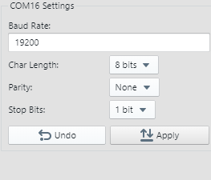

- On the right side of the terminal window, ensure “Display As: 8-bit ASCII” is selected

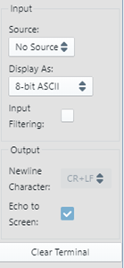

- Press the drop-down carrot next to your Curiosity Nano’s COM port and select “Send to Terminal”

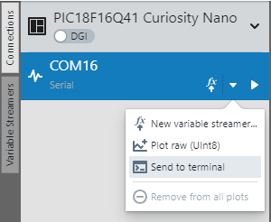

- While twisting the potentiometer’s dial, you will be able to see the changing values within the Data Visualizer terminal window

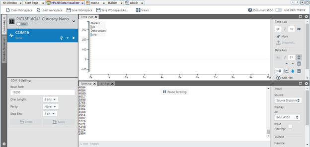


## Summary
This application demonstrates how to toggle a LED on and off at a rate of 500 milliseconds as well as how to configure an analog-serial-read using a potentiometer
